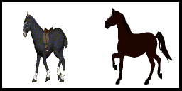
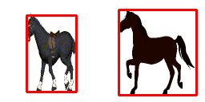
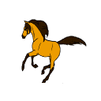
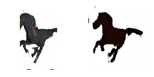
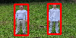
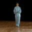

# Multi-Object Motion Transfer
## Columbia Summer '19 COMSW4995 Deep Learning Project

This repository contains the source code of video synthesis project developed by [Xipeng Xie](https://github.com/Ageneinair), [Nikita Lockshin](https://github.com/Smthri), and [LianFeng Li](https://github.com/KnightLian). This project is inspired by [Monkey-Net](http://www.stulyakov.com/papers/monkey-net.html) from Siarohin *et al.* and by [Mask-RCNN](https://github.com/matterport/Mask_RCNN) from Abdulla *et al.*

## Multi-Monkey-Net Phase 1 

### Moving-Gif
| Source | SourceRPN | Driving | Generated |
| --- | --- | --- | --- |
|  |  | ||
  
### Tai-Chi
| Source | SourceRPN | Driving | Generated |
| --- | --- | --- | --- |
|  |  | ||

### Motion transfer Demo
```
python run_all_mgif.py --config config/moving-gif.yaml --driving_video path/to/video --checkpoint path/to/checkpoint --image path/to/image --image_shape image,shape
```

## Multi-Monkey-Net Phase 2

### Motion transfer Demo
```
python run_all_taichi.py --config config/taichi.yaml --driving_video path/to/video --checkpoint path/to/checkpoint --image path/to/image --image_shape image,shape
```

## Multi-Monkey-Net Phase 3

### Motion transfer Demo
Download the checkpoint first from [here](https://drive.google.com/file/d/1mSkQPe8TTILPdPHnEJiSKVLbbRgnD2Cu/view?usp=sharing)
```
cd new-monkey-net
python demo.py --config  config/taichi.yaml --driving_video ../sup-mat/00001050.png --source_image sup-mat/64.jpg --checkpoint <path/to/checkpoint> --image_shape 64,64
```
### Train a New Network
```
cd new-monkey-net
CUDA_VISIBLE_DEVICES=0 python run.py --config config/dataset_name.yaml
```

## Installation Guide

### Install Dependencies
```
pip install -r requirements.txt
cd Mask_RCNN
pip3 install -r requirements.txt
python3 setup.py install
```

### Region Proposal Network Demo
```
python find_rois.py --image <path to input image>
```

### Motion Transfer Demo 

To run a demo, download a [checkpoint](https://drive.google.com/file/d/1zR5Wp9iagHG379jsauLyLH_BTQQqatdF/view?usp=sharing) (more checkpoint we get can be checked [HERE](#Datasets)) and run the following command:
```
python demo.py --config config/moving-gif.yaml --checkpoint <path/to/checkpoint>
```
The result will be stored in ```demo.gif```.


### Visualization of the Process
```
python demo.py --i_am_iddo_drori True --config config/moving-gif.yaml --checkpoint <path/to/checkpoint>
```


### Training

To train a model on specific dataset run:
```
CUDA_VISIBLE_DEVICES=0 python run.py --config config/dataset_name.yaml
```
The command will create a folder in the log directory (each run will create a time-stamped new directory).
Checkpoints will be saved to this folder.
To check the loss values during training in see ```log.txt```.
You can also check training data reconstructions in the ```train-vis``` subfolder.


### Datasets

1) **Shapes**. This dataset is saved along with repository. Download the [checkpoint](https://drive.google.com/file/d/108KLShVodN_KxtGUGg9cRJm0lWF0dBkg/view?usp=sharing).
Training takes about 17 minutes in Colab.

2) **Actions**. This dataset is also saved along with repository.
 And training takes about 1 hour.

3) **Tai-chi**. Becauce of copyright, the dataset can't be public, please contact the author if you need it. Download the [checkpoint](https://drive.google.com/file/d/1WTjy6_WLavQOuVO11ZDCmPIN8T4esfu2/view?usp=sharing). Training takes about 34 hours, on 1 gpu.

4) **MGif**. The preprocessed version of this dataset can be [downloaded](https://yadi.sk/d/5VdqLARizmnj3Q).
 [Check for details on this dataset](sup-mat/MGif/README.md). Download the [checkpoint](https://drive.google.com/file/d/1zR5Wp9iagHG379jsauLyLH_BTQQqatdF/view?usp=sharing). Training takes about 10 hours, on 1 gpu.

