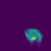
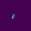
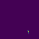
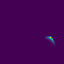
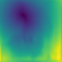
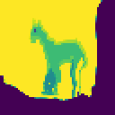

# Animating all things
### Columbia Summer '19 COMSW4995 Deep Learning Final Project

This repository contains the source code for the Columbia Summer '19 COMSW4995 Deep Learning final project by [Xipeng Xie](https://github.com/Ageneinair), [Nikita Lockshin](https://github.com/Smthri), [LianFeng Li](https://github.com/KnightLian). This project is inspired by Siarohin *et al*'s work in [Monkey-net](http://www.stulyakov.com/papers/monkey-net.html) and [Mask-RCNN](https://github.com/matterport/Mask_RCNN).

### Installation

To install the dependencies run:
```
pip install -r requirements.txt
```


### Motion Transfer Demo 

To run a demo, download a [checkpoint](https://drive.google.com/file/d/1zR5Wp9iagHG379jsauLyLH_BTQQqatdF/view?usp=sharing) (more checkpoint we get can be checked here(### Datasets)) and run the following command:
```
python demo.py --config config/moving-gif.yaml --checkpoint <path/to/checkpoint>
```
The result will be stored in ```demo.gif```.


### Visualization of the Process
```
python demo.py --i_am_iddo_drori True --config config/moving-gif.yaml --checkpoint <path/to/checkpoint>
```


### Training

To train a model on specific dataset run:
```
CUDA_VISIBLE_DEVICES=0 python run.py --config config/dataset_name.yaml
```
The command will create a folder in the log directory (each run will create a time-stamped new directory).
Checkpoints will be saved to this folder.
To check the loss values during training in see ```log.txt```.
You can also check training data reconstructions in the ```train-vis``` subfolder.


### Demo results
#### Shapes

#### Taichi


### Visualization examples
#### Shapes dataset
Heatmaps for individual keypoint locations:\
\


\
The optical flow and the sampled image:\
\

\
The source image and the result image:\
\


#### MovingGif dataset
Heatmaps for individual keypoint locations:\
\




\




\
The optical flow and the sampled image:\
\

\
The source image and the result image:\
\


[create an anchor](### Datasets)

1) **Shapes**. This dataset is saved along with repository. Download the [checkpoint](https://drive.google.com/file/d/108KLShVodN_KxtGUGg9cRJm0lWF0dBkg/view?usp=sharing).
Training takes about 17 minutes in Colab.

2) **Actions**. This dataset is also saved along with repository.
 And training takes about 1 hour.

3) **Tai-chi**. Becauce of copyright, the dataset can't be public, please contact the author if you need it. Download the [checkpoint](https://drive.google.com/file/d/1WTjy6_WLavQOuVO11ZDCmPIN8T4esfu2/view?usp=sharing). Training takes about 34 hours, on 1 gpu.

4) **MGif**. The preprocessed version of this dataset can be [downloaded](https://yadi.sk/d/5VdqLARizmnj3Q).
 [Check for details on this dataset](sup-mat/MGif/README.md). Download the [checkpoint](https://drive.google.com/file/d/1zR5Wp9iagHG379jsauLyLH_BTQQqatdF/view?usp=sharing). Training takes about 10 hours, on 1 gpu.

